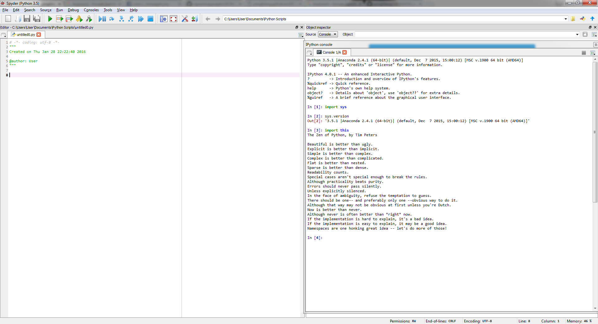

UECM3033 Assignment #1 Report
========================================================

- Prepared by: ** Vignesh a/l Nagarajah**
- Tutorial Group: T3

--------------------------------------------------------

## Task 1 -- setup a github repository

The reports, codes and supporting documents are uploaded to Github at: 

[https://github.com/vigneshnagarajah/UECM3033_assign1](https://github.com/vigneshnagarajah/UECM3033_assign1)

---------------------------------------------------------

## Task 2 -- setup python

Put here the screen shot of file (python.png)

------------------------------------------------------------

## Task 3 -- modify and run Python script

In this section, please report:

1. The hexadecimal value of your student ID.
2. Write down the definite integrals that you have chosen.
3. Write down your system of 10 linear equations.

1.0x10c9dc
2.$$\int_0^{2}x^3*{sqrt{x^2 +4}}= frac{\64}{15}+ frac{\sqrt2}{15} multiply 64 $$
3.\begin{align*}
3x_0 +x_1 +5x_2+3x_3+8x_4+8x_5+3x_6+4x_7+4x_8+7x_9  &= 9,\x_0 +2x_1 +6x_2+6x_3+4x_4+3x_5+9x_6+2x_7+5x_8+x_9  &= 8\2x_0 +5x_1 +5x_2+4x_3+4x_4+7x_5+7x_6+8x_7+2x_8+2x_9  &= 6\7x_0 +7x_1 +2x_2+3x_3+6x_4+7x_5+x_6+8x_7+8x_8+5x_9  &= 5\2x_0 +7x_1 +8x_2+9x_3+6x_4+3x_5+3x_6+x_7+5x_8+4x_9  &= 2\x_0 +x_1 +5x_2+6x_3+6x_4+9x_5+9x_6+4x_7+3x_8+8x_9  &= 2\2x_0 +4x_1 +5x_2+8x_3+8x_4+7x_5+3x_6+6x_7+9x_8+x_9  &= 3\4x_0 +5x_1 +x_2+2x_3+3x_4+8x_5+9x_6+7x_7+7x_8+7x_9  &= 3\5x_0 +4x_1 +2x_2+5x_3+5x_4+8x_5+7x_6+3x_7+x_8+x_9  &= 1\4x_0 +4x_1 +6x_2+3x_3+8x_4+2x_5+5x_6+9x_7+6x_8+6x_9  &= 7
\end{align*}

-----------------------------------

last modified: 28th January 2016e
